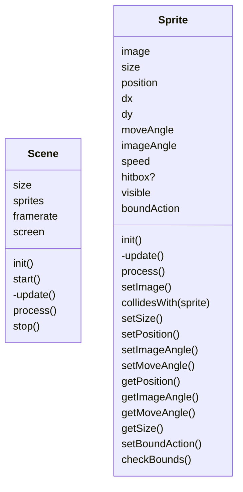

```mermaid
classDiagram
 
 class Scene {
   size
   sprites
   framerate
   screen
   init()
   start()
   -update()
   process()
   stop()
 }

 class Sprite {
    image
    size
    position
    dx
    dy
    moveAngle
    imageAngle
    speed
    hitbox?
    visible
    boundAction

    init()
    -update()
    process()
    setImage()
    collidesWith(sprite)
    setSize()
    setPosition()
    setImageAngle()
    setMoveAngle()
    getPosition()
    getImageAngle()
    getMoveAngle()
    getSize()
    setBoundAction()
    checkBounds()

 }
    
```
